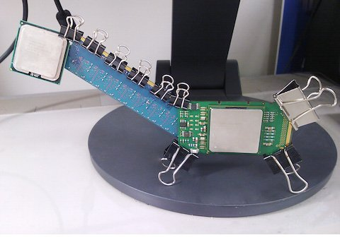
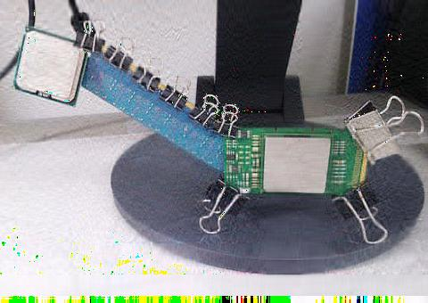

Japanese/ [English](README.md)
# 画像の低ランク近似におけるHOSVDとHOOIの比較

## 概要

画像を(高さ, 幅, 色)の3階テンソルだと思ってHOSVD(higher order singular value decomposition)とHOOI(higher order iteration of tensors)により低ランク近似し、その性能を比較する。


## 使い方

```
$ python hooi_sample.py filename ratio
```

最初の引数が入力画像、二番目が特異値の上位をどれだけ残すかの割合。例えば画像がサイズが(w,h)だとしたら、幅を`int(w*ratio)`に、高さを`int(h*ratio)`にそれぞれ落とすプロジェクタを適用する、という意味。`ratio`を指定しなかった場合のデフォルト値は0.2。

## 実行結果

```
$ python hooi_sample.py uma.jpg  
Ratio = 0.2
Performing HOSVD
0.966415890942
Saved as uma_hosvd.jpg
Performing HOOI
1.29997357769
0.977742274282
0.957462600028
0.953166704329
0.95163785607
0.950901319943
0.950467674764
0.950171911725
0.949946487327
0.949759967973
Saved as uma_hooi.jpg
```

ここで表示されている数字は規格化された残差ノルム。Xを元テンソル、XPを近似されたテンソルとして、残差rを
r = |X - XP|/|X|で定義している。HOSVDの残差ノルムが0.966415890942、HOOIの残差ノルムはステップ毎に減少し、10ステップ後に0.949759967973になるので、HOOIの方が近似が良いことがわかる。なお、HOOIのプロジェクタは、最初はランダムに与えている。

入力画像



HOSVDにより近似された画像(ratio = 0.2, r = 0.966415890942)


HOOIにより近似された画像(ratio = 0.2, r = 0.949759967973)


